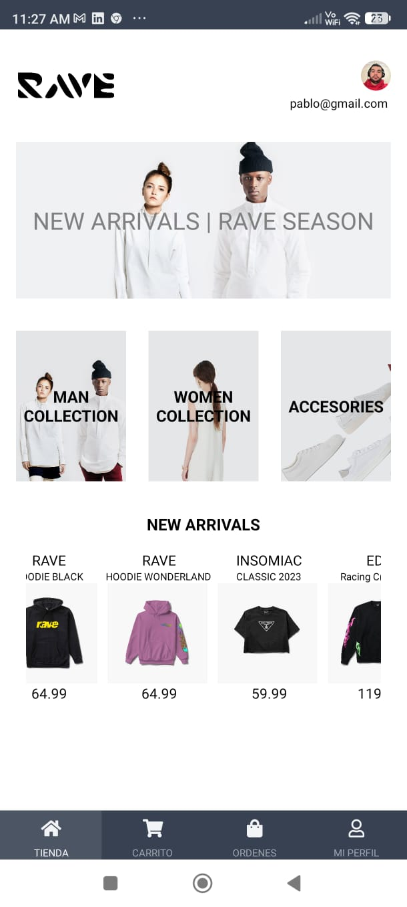

# PF_DAPPS_ARCE

Este es un proyecto de Expo creado con `create-expo-app`.

## Introducción

Este proyecto tiene como objetivo desarrollar una aplicación del tipo e-commerce utilizando Expo y React Native. A continuación, se detalla cómo comenzar a trabajar con este proyecto.

## Contenidos del Proyecto

- **app**: Contiene los componentes principales de la aplicación.
- **assets**: Contiene los recursos gráficos y de estilo.
- **components**: Contiene los componentes reutilizables de la interfaz de usuario.
- **config**: Configuraciones generales de la aplicación.
- **constants**: Constantes utilizadas en la aplicación.
- **db**: Archivos relacionados con la base de datos.
- **features**: Funcionalidades principales de la aplicación.
- **firebase**: Configuraciones y servicios de Firebase.
- **navigation**: Configuración de la navegación en la aplicación.
- **screens**: Pantallas principales de la aplicación.
- **scripts**: Scripts utilizados para diversas tareas del proyecto.
- **services**: Servicios que maneja la lógica de negocio.
- **store**: Configuración del store de Redux.
- **utils**: Funciones utilitarias.
- **validations**: Validaciones utilizadas en formularios y otros componentes.

## Comenzando

Para empezar a trabajar con este proyecto, sigue estos pasos:

### Instalación

1. Clona este repositorio:
   ```bash
   git clone https://github.com/Pabloblockchain24/PF_DAPPS_ARCE.git
   ```

2. Instala las dependencias:
   ```bash
   npm install
   ```

### Ejecución

1. Inicia la aplicación:
   ```bash
   npx expo start
   ```

En la salida, encontrarás opciones para abrir la aplicación en un **build de desarrollo**, un **emulador de Android**, un **simulador de iOS** o **Expo Go**.

## Reiniciar el Proyecto

Si necesitas un proyecto nuevo, puedes ejecutar el siguiente comando:
```bash
npm run reset-project
```

Este comando moverá el código de inicio al directorio `app-example` y creará un nuevo directorio `app` donde puedes comenzar a desarrollar.


## Captura de Pantalla

Aquí hay una captura de pantalla de la página login y principal de la aplicación:




## Aprender más

Para aprender más sobre el desarrollo con Expo, consulta los siguientes recursos:

- [Documentación de Expo](https://docs.expo.dev/)
- [Tutorial de Expo](https://docs.expo.dev/tutorial/introduction/)

## Comunidad

Únete a nuestra comunidad de desarrolladores creando aplicaciones universales:

- [Expo en GitHub](https://github.com/expo)
- [Comunidad en Discord](https://chat.expo.dev)

## Contribución

Si deseas contribuir a este proyecto, por favor sigue estos pasos:

1. Haz un fork del proyecto.
2. Crea una nueva rama (`git checkout -b feature/AmazingFeature`).
3. Realiza tus cambios y haz un commit (`git commit -m 'Add some AmazingFeature'`).
4. Sube tus cambios (`git push origin feature/AmazingFeature`).
5. Abre un Pull Request.

## Licencia

Este proyecto está bajo la licencia MIT. Consulta el archivo [LICENSE](LICENSE) para más detalles.